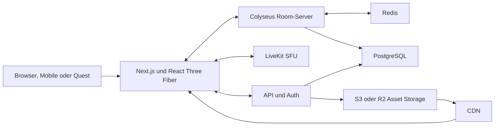

# Architekturvorschlag: browserbasiertes Multiuser-Metaverse

Stand: 13. Juli 2026

## Kurzempfehlung

Für ein Produkt ähnlich wie Spatial würde ich mit einer browserbasierten 3D-Anwendung starten:

- Web-App: TypeScript, React und Next.js
- 3D: Three.js über React Three Fiber
- Weltzustand und Multiplayer: Colyseus als autoritativer Room-Server
- Audio, Video und Screensharing: LiveKit über WebRTC
- Physik: Rapier, im Client für flüssige Darstellung und serverseitig für relevante Validierung
- Daten: PostgreSQL für dauerhafte Daten, Redis für Presence, Room-Routing und kurzlebige Zustände
- 3D-Dateien: Blender nach glTF/GLB, optimiert mit Meshopt oder Draco und KTX2-Texturen
- Dateien und CDN: S3-kompatibler Object Storage plus Cloudflare
- Betrieb: zunächst Managed Postgres, Managed Redis und LiveKit Cloud; Room-Server als Container

Der wichtigste Architekturgrundsatz: Weltzustand, Medien und dauerhafte Produktdaten sind drei getrennte Systeme.

## Zielarchitektur



## Technologie pro Schicht

| Schicht | Empfehlung | Aufgabe |
|---|---|---|
| Web-Shell | Next.js, React, TypeScript | Login, Lobby, Profile, Räume, Administration, Payments |
| 3D-Client | Three.js, React Three Fiber, Drei | Rendering, Kamera, Avatare, Animationen, Interaktionen |
| Client-State | Zustand | lokaler UI- und Client-State ohne unnötige React-Renders |
| Multiplayer | Colyseus | Rooms, Matchmaking, autoritativer Zustand, binäre Delta-Synchronisation |
| Medien | LiveKit | Mikrofon, Kamera, Screenshare und WebRTC-SFU |
| Räumlicher Ton | Web Audio API plus Avatarpositionen | Lautstärke, Stereo-Panning und Hördistanz im Client |
| Physik | Rapier | Kollision, Trigger, einfache dynamische Objekte |
| Persistenz | PostgreSQL | Accounts, Welten, Inventar, Berechtigungen, Events |
| Realtime-Infrastruktur | Redis | Presence, Room-Lookup, Pub/Sub, kurzlebige Daten |
| Assets | Blender, glTF/GLB, KTX2, Meshopt | standardisierte und komprimierte 3D-Pipeline |
| Object Storage | Cloudflare R2 oder S3 | Welten, Modelle, Texturen, Uploads |
| Monitoring | Sentry, OpenTelemetry, Prometheus/Grafana | Fehler, Traces, Server- und Room-Metriken |

## Wie Multiplayer funktionieren sollte

Ein Client sendet Eingaben wie Bewegungsrichtung, Blickrichtung oder Interaktion. Der Server prüft diese Eingaben, simuliert den relevanten Zustand und verteilt Snapshots oder Deltas. Der Client zeigt die eigene Bewegung sofort vorausberechnet an und korrigiert sie bei Abweichungen. Andere Avatare werden zwischen Serverständen interpoliert.

Empfohlener Startpunkt:

- Client-Rendering: 60 FPS, dynamisch reduziert auf schwächeren Geräten
- Server-Simulation: 15 bis 20 Ticks pro Sekunde
- Positionsupdates: quantisiert und nur bei relevanten Änderungen
- Client-Interpolation: ungefähr 100 bis 150 ms Puffer
- Interest Management: Eine Person erhält nur Entities in der eigenen Zone oder Umgebung

LiveKit transportiert Audio und Video. Colyseus transportiert die Positionen. Der Client verbindet beides und berechnet aus der Distanz zwischen Avataren die räumliche Audiowiedergabe. Medien sollten nicht als regulärer Spielzustand über Colyseus laufen.

## Skalierungsmodell

Die Plattform sollte aus vielen Instanzen beziehungsweise Rooms bestehen. Eine scheinbar grosse Welt kann aus Portalen, Gebäuden, Stockwerken oder unsichtbaren Zonen zusammengesetzt werden.

Für den ersten Release würde ich pro Room konservativ mit 25 bis 50 aktiven Avataren planen. Der reale Grenzwert hängt stark von Geometrie, Texturen, Skripten, sichtbaren Avataren und publizierten Medien-Tracks ab. Belastungstests entscheiden den Produktionswert.

Für grosse Events:

- Bühne und Moderation als Broadcast-Modus
- volle Avatare nur in der näheren Umgebung
- entfernte Personen als vereinfachte Avatare, Sprites oder Crowd-Cluster
- Audio-Abonnements nur im Hörbereich
- getrennte Audience-Shards mit gemeinsamem Bühnenstream und Chat

## Asset-Pipeline

Die Performance einer Web-3D-Welt wird oft stärker durch Assets als durch das Framework bestimmt. Deshalb gehören Budgets in den Publishing-Prozess:

- glTF/GLB als primäres Laufzeitformat
- mehrere LOD-Stufen pro wichtigem Modell
- KTX2/Basis für GPU-komprimierte Texturen
- Meshopt oder Draco für Geometriekompression
- Instancing für wiederholte Objekte
- Lightmaps und gebackene Beleuchtung für statische Umgebungen
- automatischer CI-Check für Dateigrösse, Polygonzahl, Texturen und fehlende LODs
- progressive Downloads pro Zone statt einer einzigen grossen GLB-Datei

## Sicherheits- und Moderationsgrundlagen

- Der Server bleibt die Quelle der Wahrheit für Bewegung, Inventar, Besitz und Interaktionen.
- Clients erhalten kurzlebige, raumgebundene Tokens für Colyseus und LiveKit.
- Uploads laufen über signierte URLs mit Typ-, Grössen- und Malware-Prüfung.
- Rollen und Rechte gelten pro Organisation, Welt und Raum.
- Mute, Block, Kick, Ban, Melden und Moderationsprotokolle gehören ins MVP.
- Chat, Voice-Metadaten und Uploads haben Rate Limits.
- Private Räume brauchen explizite Zugriffskontrollen. Eine schwer erratbare URL reicht nicht.

## Sinnvoller MVP

### Phase 1: technischer Vertical Slice

- Eine kleine optimierte 3D-Welt
- Gastlogin oder Magic Link
- Avatar bewegen und animieren
- 10 bis 20 Personen in einem Room
- räumliches Audio
- Textchat und Emotes
- ein interaktives Objekt
- Telemetrie und einfacher Lasttest

### Phase 2: Produktbasis

- Raumverzeichnis und Einladungen
- Avatarwahl und Profile
- Bildschirmfreigabe auf einer virtuellen Leinwand
- Rollen, Moderation und private Räume
- persistente Objekte und einfache Raumkonfiguration
- Mobile- und Low-End-Grafikprofil

### Phase 3: Plattform

- visueller World Editor
- User-Uploads und Asset-Prüfung
- Vorlagen, Organisationen und Berechtigungen
- Analytics und Abrechnung
- WebXR als zusätzlicher Modus für unterstützte Geräte

WebXR sollte nach dem Desktop- und Mobile-Browser kommen. Die Browserunterstützung ist weiterhin uneinheitlich, während Desktop und Mobile die grösste Reichweite bieten.

## Codebasis

```text
apps/
  web/             Next.js, UI, Lobby und 3D-Client
  api/             Produkt-API, Auth, Uploads und Administration
  world-server/    Colyseus Rooms und autoritative Simulation
packages/
  protocol/        gemeinsame Schemas, Messages und Events
  world/           3D-Komponenten und Interaktionen
  assets/          Asset-Manifest und Loader
  config/          TypeScript-, Lint- und Build-Konfiguration
infra/
  docker/
  terraform/
```

Die gemeinsamen Netzwerktypen gehören in ein eigenes Package. Das verhindert, dass Client und Server bei Messages oder State-Schemas auseinanderlaufen.

## Wann Unity oder Unreal besser wären

| Situation | Wahl |
|---|---|
| Browserzugang per Link, schnelle Reichweite, SaaS-Produkt | Three.js und React Three Fiber |
| Native Desktop- oder Quest-App mit komplexer Spielmechanik | Unity plus Photon Fusion oder Nakama |
| sehr hohe visuelle Qualität, PC-first, virtuelle Produktion | Unreal Engine |
| riesige Szene mit serverseitigem Rendering | Unreal Pixel Streaming, mit höherer GPU- und Streaming-Kostenstruktur |

Für ein Spatial-ähnliches Produkt ist die Web-Variante die beste Ausgangsbasis. Unity Web ist für grosse Browserprodukte oft schwerer, langsamer beim initialen Laden und weniger natürlich mit Web-UI, Auth und SaaS-Funktionen verbunden.

## Technische Entscheidungen vor dem Start

1. Wie viele Personen müssen gleichzeitig in einem Raum sein?
2. Muss das Produkt auf Smartphones funktionieren?
3. Sind VR-Headsets Kernziel oder Zusatzmodus?
4. Dürfen Nutzer:innen eigene Welten und 3D-Assets hochladen?
5. Braucht es persistente Inventare, Payments oder digitale Güter?
6. Welche Datenregionen und Datenschutzanforderungen gelten?
7. Geht es primär um Meetings, Events, Lernen, Showrooms oder Games?

Diese Antworten verändern vor allem Sharding, Moderation, Asset-Pipeline und Betriebsmodell. Der grundlegende Stack bleibt weitgehend gleich.

## Offizielle Referenzen

- React Three Fiber: https://r3f.docs.pmnd.rs/getting-started/introduction
- Colyseus State Synchronization: https://docs.colyseus.io/state
- Colyseus Core Concepts: https://docs.colyseus.io/concepts
- LiveKit SFU: https://docs.livekit.io/reference/internals/livekit-sfu/
- LiveKit Distributed Multi-Region: https://docs.livekit.io/transport/self-hosting/distributed/
- Rapier: https://rapier.rs/docs/
- WebXR: https://developer.mozilla.org/en-US/docs/Web/API/WebXR_Device_API
